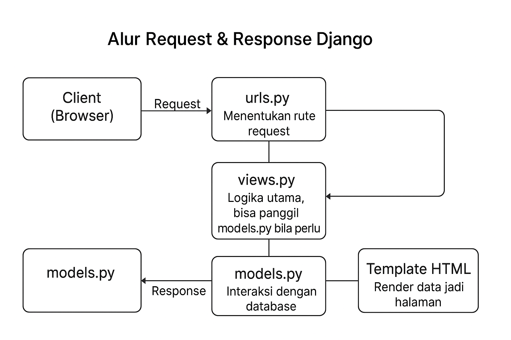

# real-madrid-shop
# Link yang sudah di deploy
Aplikasi Football Shop
https://pbp.cs.ui.ac.id/ghalen.cakra/realmadridshop
# 1. Jelaskan bagaimana cara kamu mengimplementasikan checklist di atas secara step-by-step (bukan hanya sekadar mengikuti tutorial).
Saya mengimplementasikan checklist dengan langkah-langkah berikut. Pertama, saya membuat virtual environment dan menginstall dependensi utama, serta menambahkan file .env dan .env.prod untuk memisahkan konfigurasi development dan production. Selanjutnya, saya membuat proyek Django baru dengan startproject dan aplikasi main dengan startapp, lalu mendaftarkannya pada settings.py. Model Product dibuat di models.py dengan atribut yang diminta, kemudian saya melakukan migrasi database dan mendaftarkan model ke admin agar mudah diuji. Pada views.py, saya menambahkan fungsi yang menampilkan nama aplikasi, nama, kelas, serta daftar produk, dan dipetakan melalui urls.py serta ditampilkan dengan template HTML. Setelah berhasil diuji di server lokal, saya menyiapkan deployment dengan menambahkan requirements.txt, Dockerfile, serta memastikan settings.py membaca konfigurasi dari variabel lingkungan. Seluruh perubahan dicatat dengan Git, termasuk menambahkan .gitignore untuk menjaga kebersihan repositori. Terakhir, saya melakukan push ke GitHub dan deploy ke PWS sesuai instruksi hingga aplikasi dapat diakses secara publik.

# 2. Buatlah bagan yang berisi request client ke web aplikasi berbasis Django beserta responnya dan jelaskan pada bagan tersebut kaitan antara urls.py, views.py, models.py, dan berkas html.

ChatGPT said:

1. Client (Browser)

  - Pengguna membuka halaman web (misalnya mengetik URL atau klik link).

  - Browser mengirim HTTP Request (GET/POST/PUT/DELETE, dll) ke server Django.

2. urls.py (Routing)

 - Django menerima request dan mencocokkan  URL dengan pola yang sudah didefinisikan di urls.py.

 - Fungsinya adalah menentukan request ini akan diarahkan ke view function atau class-based view mana.

3. views.py (Logika Aplikasi)

 - Setelah urls.py mengarahkan request, kontrol berpindah ke views.py.

 - views.py berisi logika utama, misalnya:

   - mengambil data dari database (via models.py),

   - memproses input dari user,

   - atau langsung mengembalikan response sederhana.

4. models.py (Interaksi Database)

  - Jika view butuh data dari database, dia akan memanggil models.py.

  - models.py menggunakan Django ORM (Object Relational Mapping) untuk query database, misalnya ambil data, simpan data, update, hapus, dll.

  - Setelah data diperoleh/diolah, hasilnya dikembalikan ke views.py.

5. Template HTML (Presentasi)

 - views.py lalu menyiapkan context (data) dan mengirimkannya ke template (file .html).

 - Template ini akan merender data menjadi halaman web yang bisa dibaca browser.

6. Response ke Client (Browser)

 - Hasil render (HTML) dikirim kembali ke browser.

- Browser menampilkan halaman ke pengguna sebagai HTTP Response.

# 3. Jelaskan peran settings.py dalam proyek Django!
settings.py adalah “otak pusat” konfigurasi proyek Django. Semua pengaturan penting untuk proyek berada di file ini. Bisa dibilang, kalau Django itu tubuh, settings.py adalah sistem sarafnya.

Beberapa peran utama settings.py antara lain:

- Mengatur database
Di sini kita menentukan jenis database yang dipakai (misal SQLite, PostgreSQL, MySQL), nama database, user, password, dan host. Jadi setiap aplikasi Django tahu ke mana harus menyimpan data.

- Menentukan aplikasi yang dipakai (INSTALLED_APPS)
Semua aplikasi (app) yang kita buat atau pakai pihak ketiga harus didaftarkan di INSTALLED_APPS. Django akan membaca ini untuk memuat app dan menjalankan fungsinya.

- Mengatur URL, template, dan static files

  1. TEMPLATES → tempat Django mencari file HTML.

 2. STATIC_URL dan MEDIA_URL → lokasi file statis (CSS, JS, gambar) dan media (upload user).

- Pengaturan keamanan

  1. SECRET_KEY → kunci rahasia untuk keamanan proyek.

  2. DEBUG → mode pengembangan (kalau True, error akan ditampilkan, kalau False, aman untuk produksi).

 3. ALLOWED_HOSTS → daftar domain yang boleh mengakses aplikasi.

- Konfigurasi tambahan lain
Misal bahasa (LANGUAGE_CODE), zona waktu (TIME_ZONE), atau middleware yang dijalankan sebelum/selesai request.

# 4. Bagaimana cara kerja migrasi database di Django?
Di Django, migrasi database adalah cara untuk menyelaraskan model yang kita buat di kode dengan struktur database. Saat model dibuat atau diubah, perintah `makemigrations` akan membuat file migrasi yang berisi instruksi perubahan, kemudian perintah `migrate` akan menjalankan instruksi tersebut di database. Dengan cara ini, perubahan tabel, kolom, atau hubungan antar tabel bisa diterapkan secara teratur dan aman, tanpa harus mengubah database secara manual.

# 5. Menurut Anda, dari semua framework yang ada, mengapa framework Django dijadikan permulaan pembelajaran pengembangan perangkat lunak?
Django sering dipilih sebagai awal pembelajaran pengembangan perangkat lunak karena menyediakan banyak fitur siap pakai, menggunakan Python yang mudah dipahami, dan menerapkan arsitektur MVT yang terstruktur. Dengan sistem ORM, migrasi database otomatis, serta fitur autentikasi dan manajemen data, mahasiswa bisa fokus belajar logika aplikasi dan konsep web development tanpa terganggu kompleksitas teknis.

# 6. Apakah ada feedback untuk asisten dosen tutorial 1 yang telah kamu kerjakan sebelumnya?
Tutorial 1 sangat membantu sekali untuk memahami konsep dasar MVT. secara keseluruhan, penyampaian materi cukup jelas dan terstruktur."

