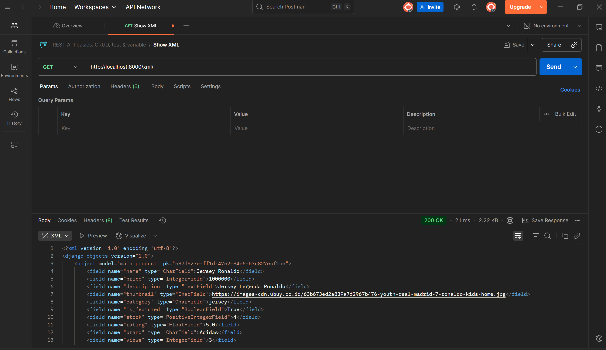
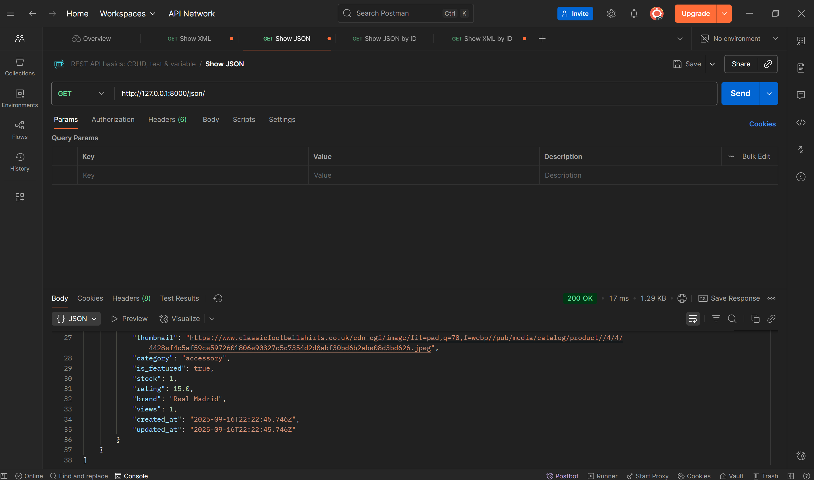
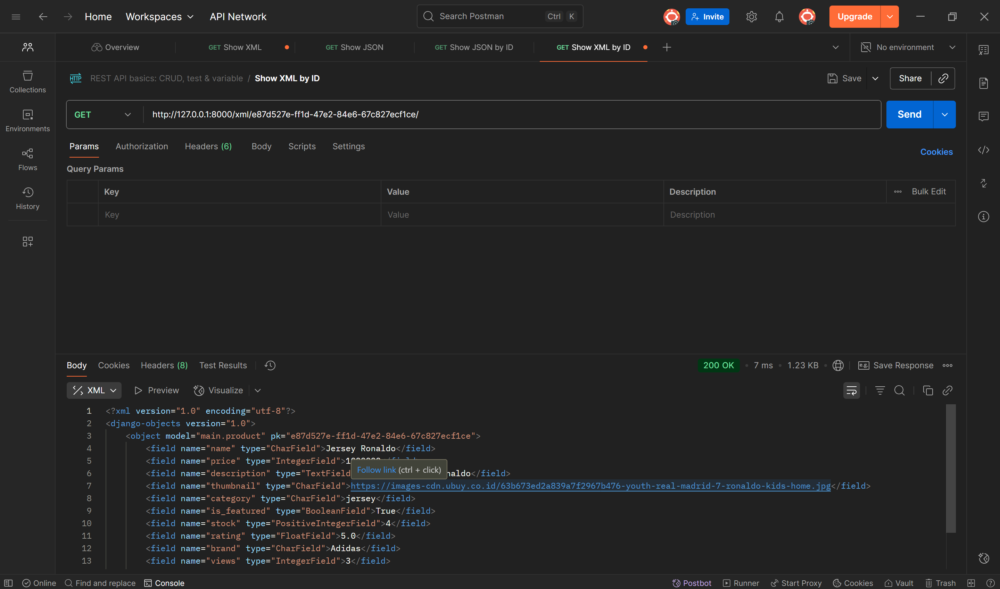
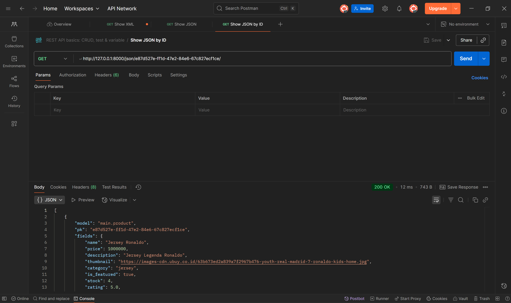

# real-madrid-shop
# Link yang sudah di deploy
Aplikasi Football Shop
https://pbp.cs.ui.ac.id/ghalen.cakra/realmadridshop
# 1. Jelaskan bagaimana cara kamu mengimplementasikan checklist di atas secara step-by-step (bukan hanya sekadar mengikuti tutorial).
Saya mengimplementasikan checklist dengan langkah-langkah berikut. Pertama, saya membuat virtual environment dan menginstall dependensi utama, serta menambahkan file .env dan .env.prod untuk memisahkan konfigurasi development dan production. Selanjutnya, saya membuat proyek Django baru dengan startproject dan aplikasi main dengan startapp, lalu mendaftarkannya pada settings.py. Model Product dibuat di models.py dengan atribut yang diminta, kemudian saya melakukan migrasi database dan mendaftarkan model ke admin agar mudah diuji. Pada views.py, saya menambahkan fungsi yang menampilkan nama aplikasi, nama, kelas, serta daftar produk, dan dipetakan melalui urls.py serta ditampilkan dengan template HTML. Setelah berhasil diuji di server lokal, saya menyiapkan deployment dengan menambahkan requirements.txt, Dockerfile, serta memastikan settings.py membaca konfigurasi dari variabel lingkungan. Seluruh perubahan dicatat dengan Git, termasuk menambahkan .gitignore untuk menjaga kebersihan repositori. Terakhir, saya melakukan push ke GitHub dan deploy ke PWS sesuai instruksi hingga aplikasi dapat diakses secara publik.

# 2. Buatlah bagan yang berisi request client ke web aplikasi berbasis Django beserta responnya dan jelaskan pada bagan tersebut kaitan antara urls.py, views.py, models.py, dan berkas html.

ChatGPT said:

1. Client (Browser)

  - Pengguna membuka halaman web (misalnya mengetik URL atau klik link).

  - Browser mengirim HTTP Request (GET/POST/PUT/DELETE, dll) ke server Django.

2. urls.py (Routing)

 - Django menerima request dan mencocokkan  URL dengan pola yang sudah didefinisikan di urls.py.

 - Fungsinya adalah menentukan request ini akan diarahkan ke view function atau class-based view mana.

3. views.py (Logika Aplikasi)

 - Setelah urls.py mengarahkan request, kontrol berpindah ke views.py.

 - views.py berisi logika utama, misalnya:

   - mengambil data dari database (via models.py),

   - memproses input dari user,

   - atau langsung mengembalikan response sederhana.

4. models.py (Interaksi Database)

  - Jika view butuh data dari database, dia akan memanggil models.py.

  - models.py menggunakan Django ORM (Object Relational Mapping) untuk query database, misalnya ambil data, simpan data, update, hapus, dll.

  - Setelah data diperoleh/diolah, hasilnya dikembalikan ke views.py.

5. Template HTML (Presentasi)

 - views.py lalu menyiapkan context (data) dan mengirimkannya ke template (file .html).

 - Template ini akan merender data menjadi halaman web yang bisa dibaca browser.

6. Response ke Client (Browser)

 - Hasil render (HTML) dikirim kembali ke browser.

- Browser menampilkan halaman ke pengguna sebagai HTTP Response.

# 3. Jelaskan peran settings.py dalam proyek Django!
settings.py adalah “otak pusat” konfigurasi proyek Django. Semua pengaturan penting untuk proyek berada di file ini. Bisa dibilang, kalau Django itu tubuh, settings.py adalah sistem sarafnya.

Beberapa peran utama settings.py antara lain:

- Mengatur database
Di sini kita menentukan jenis database yang dipakai (misal SQLite, PostgreSQL, MySQL), nama database, user, password, dan host. Jadi setiap aplikasi Django tahu ke mana harus menyimpan data.

- Menentukan aplikasi yang dipakai (INSTALLED_APPS)
Semua aplikasi (app) yang kita buat atau pakai pihak ketiga harus didaftarkan di INSTALLED_APPS. Django akan membaca ini untuk memuat app dan menjalankan fungsinya.

- Mengatur URL, template, dan static files

  1. TEMPLATES → tempat Django mencari file HTML.

 2. STATIC_URL dan MEDIA_URL → lokasi file statis (CSS, JS, gambar) dan media (upload user).

- Pengaturan keamanan

  1. SECRET_KEY → kunci rahasia untuk keamanan proyek.

  2. DEBUG → mode pengembangan (kalau True, error akan ditampilkan, kalau False, aman untuk produksi).

 3. ALLOWED_HOSTS → daftar domain yang boleh mengakses aplikasi.

- Konfigurasi tambahan lain
Misal bahasa (LANGUAGE_CODE), zona waktu (TIME_ZONE), atau middleware yang dijalankan sebelum/selesai request.

# 4. Bagaimana cara kerja migrasi database di Django?
Di Django, migrasi database adalah cara untuk menyelaraskan model yang kita buat di kode dengan struktur database. Saat model dibuat atau diubah, perintah `makemigrations` akan membuat file migrasi yang berisi instruksi perubahan, kemudian perintah `migrate` akan menjalankan instruksi tersebut di database. Dengan cara ini, perubahan tabel, kolom, atau hubungan antar tabel bisa diterapkan secara teratur dan aman, tanpa harus mengubah database secara manual.

# 5. Menurut Anda, dari semua framework yang ada, mengapa framework Django dijadikan permulaan pembelajaran pengembangan perangkat lunak?
Django sering dipilih sebagai awal pembelajaran pengembangan perangkat lunak karena menyediakan banyak fitur siap pakai, menggunakan Python yang mudah dipahami, dan menerapkan arsitektur MVT yang terstruktur. Dengan sistem ORM, migrasi database otomatis, serta fitur autentikasi dan manajemen data, mahasiswa bisa fokus belajar logika aplikasi dan konsep web development tanpa terganggu kompleksitas teknis.

# 6. Apakah ada feedback untuk asisten dosen tutorial 1 yang telah kamu kerjakan sebelumnya?
Tutorial 1 sangat membantu sekali untuk memahami konsep dasar MVT. secara keseluruhan, penyampaian materi cukup jelas dan terstruktur."

# Tugas 3
# 1. Mengapa kita perlu data delivery?
Data delivery diperlukan dalam pengembangan platform karena memungkinkan pertukaran informasi antar sistem atau antar lapisan aplikasi secara efisien dan terstruktur. Dengan adanya data delivery, data yang tersimpan di server dapat dikirimkan ke klien, aplikasi mobile, atau antarmuka web dengan format standar, sehingga interoperabilitas dan konsistensi data dapat terjaga.

# 2. Mana yang lebih baik antara XML dan JSON? Mengapa JSON lebih populer dibandingkan XML?
Baik XML maupun JSON memiliki keunggulan masing-masing, namun JSON lebih sering digunakan dalam pengembangan aplikasi modern. JSON lebih ringkas dan memiliki sintaks yang lebih sederhana dibandingkan XML, sehingga memudahkan proses parsing dan integrasi dengan berbagai bahasa pemrograman. Selain itu, JSON merupakan format native pada JavaScript, sehingga kompatibilitas dengan aplikasi web berbasis JavaScript lebih baik dibandingkan XML. Hal ini menjadikan JSON lebih efisien dan populer dalam praktik pengembangan saat ini.

# 3. Fungsi dari method is_valid() pada form Django
Method is_valid() digunakan untuk memeriksa apakah data yang diinputkan oleh pengguna sesuai dengan aturan validasi yang telah didefinisikan pada form. Fungsi ini memastikan bahwa hanya data yang valid yang dapat disimpan ke dalam basis data, sehingga integritas dan konsistensi data tetap terjaga.

# 4. Mengapa kita membutuhkan csrf_token pada form Django?
Token CSRF (Cross-Site Request Forgery) digunakan untuk melindungi aplikasi dari serangan CSRF, yaitu serangan yang memanfaatkan sesi pengguna untuk melakukan aksi tanpa sepengetahuan pengguna. Dengan menambahkan csrf_token pada form, server dapat memverifikasi bahwa request yang diterima benar-benar berasal dari pengguna yang sah. Tanpa token ini, aplikasi berisiko menjadi target serangan yang dapat mengeksploitasi hak akses pengguna.

# 5. Implementasi checklist secara step-by-step
Implementasi dilakukan secara bertahap dengan prosedur sebagai berikut:

 1. Membuat model untuk mendefinisikan struktur data yang akan digunakan.

 2. Membuat form yang terkait dengan model untuk menerima input dari pengguna.

 3. Membuat views untuk menangani logika bisnis, termasuk menampilkan data, menerima input form, dan menyajikan data dalam format XML atau JSON.

 4. Membuat template HTML untuk menampilkan halaman list, form, dan detail objek.

 5. Menambahkan routing URL untuk setiap view agar dapat diakses melalui browser atau API.

 6. Menguji seluruh fungsi menggunakan server lokal dan Postman untuk memastikan data dapat dikirim dan diterima sesuai dengan format yang ditentukan.

7. Melakukan dokumentasi dan penulisan laporan pada README.md untuk mendeskripsikan implementasi dan hasil uji.

# 6. feedback untuk asdos di tutorial 2 yang sudah kalian kerjakan?
sudah cukup bagus dan jelas.

# Hasil screenshot dari hasil akses URL pada Postman
## XML Semua Product

## JSON Semua Product

## XML by ID

## JSON by ID

# Tugas 4
# 1. Apa itu Django AuthenticationForm? Jelaskan juga kelebihan dan kekurangannya.
AuthenticationForm adalah kelas bawaan Django (django.contrib.auth.forms.AuthenticationForm) yang menyediakan form autentikasi standar untuk memverifikasi kredensial pengguna. Form ini menerima input username dan password, kemudian memvalidasi data dengan sistem autentikasi Django.

Kelebihan

 - Integrasi penuh dengan sistem autentikasi   Django: Tidak perlu membuat validasi manual untuk username dan password.

 - Keamanan bawaan: Menggunakan mekanisme hashing password dan proteksi CSRF secara default.

 - Mudah diperluas: Dapat di-customize melalui subclass untuk menambah field atau mengubah tampilan.

Kekurangan

 - Terbatas pada field standar: Hanya menangani username dan password; penambahan logika khusus memerlukan subclassing.

 - Ketergantungan pada model User default: Jika menggunakan model user yang sangat berbeda, penyesuaian tambahan diperlukan.

 # 2. Apa perbedaan antara autentikasi dan otorisasi? Bagaiamana Django mengimplementasikan kedua konsep tersebut?
 Perbedaan mendasar antara autentikasi dan otorisasi penting untuk dipahami. Autentikasi adalah proses memverifikasi identitas pengguna untuk memastikan bahwa mereka adalah pihak yang sah, sedangkan otorisasi menentukan hak akses atau izin setelah identitas diverifikasi. Dalam Django, autentikasi disediakan melalui modul django.contrib.auth yang menggunakan backend seperti ModelBackend untuk mencocokkan kredensial. Fungsi authenticate() dan login() menjadi inti proses ini. Otorisasi diimplementasikan melalui sistem permissions dan groups yang melekat pada model User, dilengkapi dengan dekorator seperti @login_required dan permission_required untuk membatasi akses ke view. Django juga mendukung custom permissions yang dapat didefinisikan langsung pada model untuk kebutuhan kontrol akses yang lebih kompleks.

 # 3. Apa saja kelebihan dan kekurangan session dan cookies dalam konteks menyimpan state di aplikasi web?
 Dalam penyimpanan state pada aplikasi web, Django menyediakan dua pendekatan utama, yaitu session dan cookies. Session menyimpan data di sisi server, sehingga relatif lebih aman karena pengguna tidak dapat mengubah isi data secara langsung dan mendukung penyimpanan informasi kompleks. Kelemahannya, session memerlukan penyimpanan di server (misalnya basis data atau cache) dan bergantung pada identifikasi melalui cookie berisi session ID. Sebaliknya, cookies menyimpan data langsung di sisi klien sehingga beban server lebih ringan dan cocok untuk informasi sederhana seperti preferensi tampilan. Namun, cookies lebih rentan karena dapat diubah pengguna, memiliki batas ukuran (umumnya 4 KB), dan berpotensi disalahgunakan jika tidak diamankan.

# 4.  Apakah penggunaan cookies aman secara default dalam pengembangan web, atau apakah ada risiko potensial yang harus diwaspadai? Bagaimana Django menangani hal tersebut?
Penggunaan cookies tidak sepenuhnya aman secara default karena data yang dikirim dapat dicegat atau dimodifikasi. Untuk mengurangi risiko ini, Django menyediakan beberapa mekanisme perlindungan. Opsi SESSION_COOKIE_SECURE memastikan cookie hanya dikirim melalui koneksi HTTPS, sedangkan SESSION_COOKIE_HTTPONLY mencegah akses cookie melalui JavaScript, mengurangi potensi serangan cross-site scripting (XSS). Django juga menandatangani cookies agar setiap perubahan yang tidak sah dapat terdeteksi, serta menyertakan token CSRF secara otomatis untuk melindungi dari serangan cross-site request forgery.

# 5. Jelaskan bagaimana cara kamu mengimplementasikan checklist di atas secara step-by-step (bukan hanya sekadar mengikuti tutorial).
Pertama saya menyiapkan proyek Django dengan mengaktifkan virtual environment dan memastikan paket django.contrib.auth serta django.contrib.sessions sudah terdaftar di INSTALLED_APPS. Setelah itu saya mulai menambahkan fitur registrasi pengguna. Di berkas views.py saya mengimpor UserCreationForm dan messages, lalu menulis fungsi register yang menampilkan form pendaftaran, memvalidasi input, menyimpan akun baru, dan menampilkan pesan sukses. Saya membuat template baru register.html untuk menampilkan form tersebut dan menambahkan path baru register/ pada urls.py.

Langkah berikutnya adalah login. Saya menambahkan AuthenticationForm, authenticate, dan login ke views.py, kemudian membuat fungsi login_user untuk memproses autentikasi. Template login.html saya siapkan agar pengguna bisa memasukkan kredensial dan, jika valid, diarahkan ke halaman utama. Untuk logout, saya menambahkan fungsi logout_user yang memanggil logout(request) dan mengarahkan pengguna kembali ke halaman login, sekaligus menambahkan tombol logout di main.html.

Supaya halaman utama hanya bisa diakses oleh pengguna yang sudah login, saya menambahkan decorator @login_required pada fungsi show_main dan show_news. Selanjutnya saya menambahkan mekanisme cookie dengan menyimpan waktu terakhir login sebagai last_login di dalam fungsi login_user. Data cookie ini saya tampilkan di halaman utama melalui context dan dihapus lagi saat pengguna logout.

Terakhir, saya menghubungkan model News dengan User. Di models.py saya menambahkan field user = models.ForeignKey(User, on_delete=models.CASCADE, null=True), melakukan migrasi, dan memodifikasi fungsi create_news agar setiap berita otomatis disimpan bersama informasi pengguna yang sedang login. Fungsi show_main saya perbarui untuk menampilkan artikel sesuai filter “all” atau hanya artikel milik pengguna, dan menambahkan nama author di news_detail.html.

Setelah semua langkah selesai, saya menjalankan server Django dan menguji proses pendaftaran, login, logout, serta pembatasan akses. Hasilnya, setiap akun hanya dapat melihat berita yang dibuat sendiri, cookie last_login tercatat dan terhapus sesuai alur.

